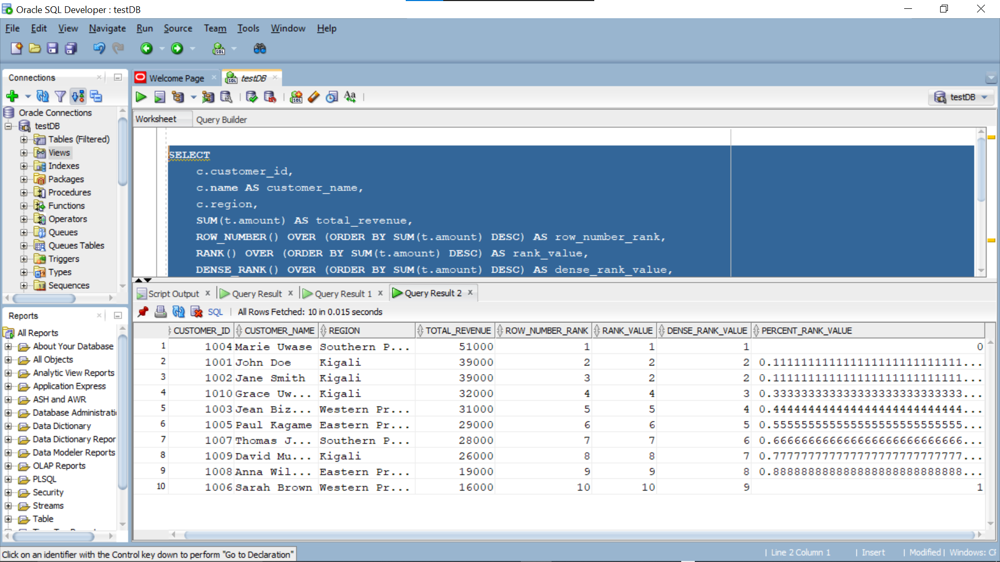
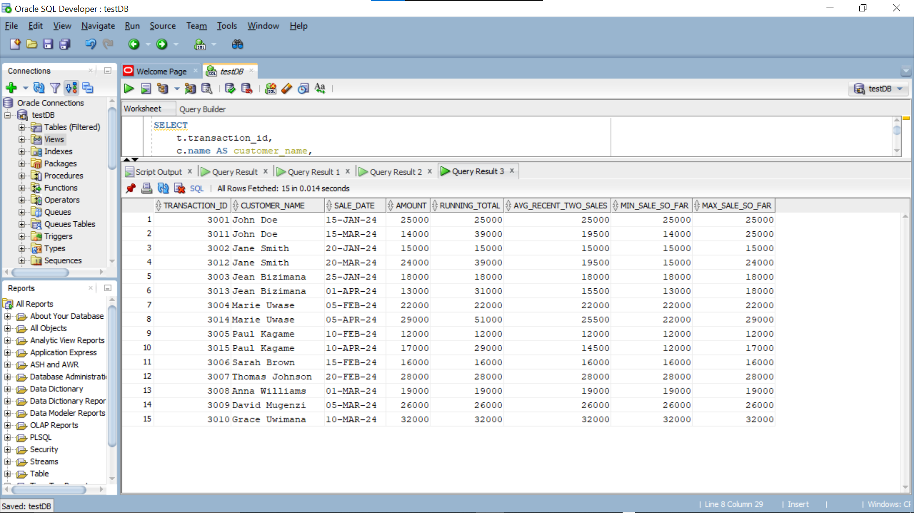
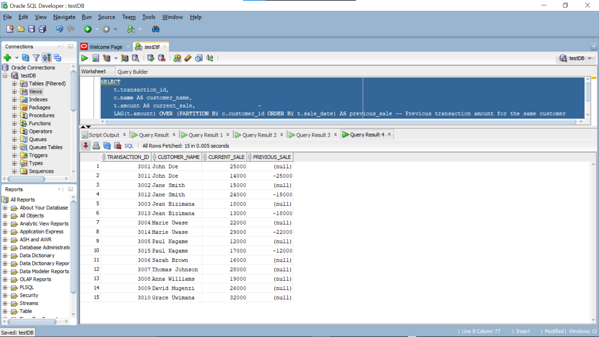
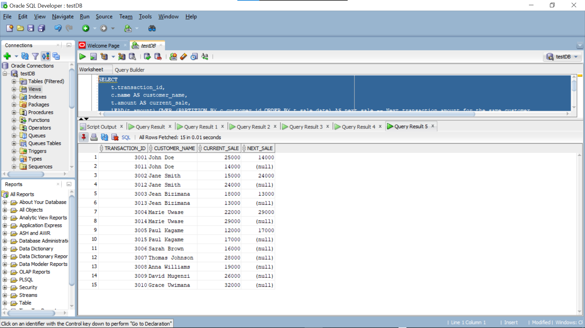
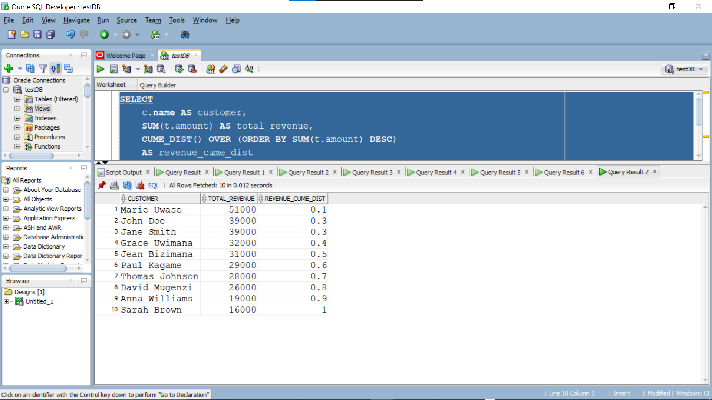

# PL/SQL Window Functions Assignment

**Student:** Byiringiro Olivier  27119
**Course:** Database Development with PL/SQL (INSY 8311)  
**Instructor:** Eric Maniraguha 
**Date:** 2025-09-23  

=====================================================================
## 1. Problem Definition
**Business Context:**  
Inyange milk supply company sells milk and dairy products across Rwanda. The company wants to understand which products sell best, how customers purchase over time, and which regions generate the most revenue.

=======================================================================

**Data Challenge:**  
The company collects data on customer purchases, products, and transaction amounts, but it currently lacks insights into product performance, monthly sales trends, customer purchase frequency, and customer segmentation.

=======================================================================
**Expected Outcome:**  
Management wants to:  
- Identify top products per region  
- Calculate running monthly sales totals  
- Analyze month-over-month growth  
- Segment customers into quartiles for marketing  
- Compute 3-month moving averages for trend analysis

=======================================================================

## 2. Success Criteria
1. Top 5 products per region/quarter → `RANK()`  
2. Running monthly sales totals → `SUM() OVER()`  
3. Month-over-month growth → `LAG()/LEAD()`  
4. Customer quartiles → `NTILE(4)`  
5. 3-month moving averages → `AVG() OVER()`

=======================================================================

## 3. Database Schema
**Tables:**  

I designed 3 tables: `Customers`, `Products`, and `Transactions`.

- **Customers Table:** Stores customer details such as name, region, and email.  
- **Products Table:** Stores product catalog information including name and price.  
- **Transactions Table:** Stores each purchase with customer ID, product ID, and purchase date.

**Screenshots:** See `/screenshots/schema_creation/`

I also inserted sample records into all three tables.

- Customers: 10 sample customers across different regions.  
- Products: 5–6 dairy products (e.g., Inyange Milk 500ml, Yoghurt, Butter).  
- Transactions: 15+ transactions linking customers to products with dates and amounts.

**Screenshots:** See `/screenshots/data_insertion/`

**ER Diagram Placeholder:** ``  

===========================================================================
## 4. Window Functions

- **Ranking Function:** I ranked the Top N Customers by Total Revenue and calculated total revenue per customer and ranked them as well.

**Interpretation:**
The top customers by total revenue are identified. ROW_NUMBER() uniquely numbers customers, RANK() shows positions with gaps for ties, DENSE_RANK() avoids gaps, and PERCENT_RANK() shows each customer’s relative position in the dataset.

- **Aggregate Function:** Running total of sales amount per customer by date

**Interpretation:** 
-running_total: Shows cumulative spending per customer over time.

-avg_recent_two_sales: Smooths out fluctuations by averaging current + previous sales.

-min_sale_so_far: Tracks the lowest transaction per customer up to that point.

-max_sale_so_far: Tracks the highest transaction per customer up to that point.

-This gives a clear picture of customer purchase behavior and trends in one view.

- **Navigation Function:** 

**Interpretation:** 
-Shows the current sale and the previous sale for each customer.

-Helps see if spending is increasing or decreasing compared to last purchase.

**Interpretation:** 
-Shows current sale and the next sale for each customer.

-Useful to predict trends and see what customers buy next.

- **Distribution Function:** 

**Interpretation:** 
-Divides customers into 4 groups based on spending.

-Quartile 1 = top spenders, Quartile 4 = lowest spenders.

-Helps target marketing or loyalty programs.

**Interpretation:** 
-The highest-spending customer has the lowest CUME_DIST() value close to 0.

-Customers with smaller revenue have values closer to 1.

-Useful for identifying top-performing customers relative to all others.
==========================================================================

## 5. Results Analysis

### Descriptive Analysis
Inyange Milk is the top-performing product across all regions, generating the highest revenue. Sales show consistent growth from January to March 2024. Kigali region contributes the most to overall sales, while dairy products outperform beverages and water categories.

### Diagnostic Analysis
Dairy products like milk and yogurt drive revenue due to higher demand and pricing. Monthly growth reflects consistent customer purchasing patterns and effective distribution. Regional performance variations are influenced by population density and retail network coverage.

### Prescriptive Analysis
Focus marketing on expanding dairy product reach in Eastern and Western provinces. Increase promotional activities for lower-performing categories like water. Use monthly trend data to optimize inventory planning and regional allocation.

==============================================================================

## References

1. Oracle Corporation. (2023). *Oracle Database SQL Language Reference - Analytic Functions*. [Link](https://docs.oracle.com/en/database/oracle/oracle-database/19/sqlrf/Analytic-Functions.html)

2. Oracle Tutorial. (2024). *Oracle Analytic Functions Guide*. [Link](https://www.oracletutorial.com/oracle-analytic-functions/)

3. Rwanda Dairy Development Program. (2012). *Rwanda National Dairy Consumer Survey Analysis & Marketing Strategy Recommendations Workshop: Inyange Industries Case Study*. [Link](https://cgspace.cgiar.org/server/api/core/bitstreams/f6ca3dbb-b395-4d46-8220-d558d06a9610/content)

4. Oracle Base. (2023). *Analytic Functions in Oracle*. [Link](https://oracle-base.com/articles/misc/analytic-functions)

5. Ngendahimana, L. (2021). *Impact of Supply Chain Management on Business Growth: The Case of Inyange Industries Ltd*. [Link](https://dr.ur.ac.rw/bitstream/handle/123456789/139/Ngendahimana%20Ladislas.pdf?sequence=1&isAllowed=y)

6. TechOnTheNet. (2024). *Oracle/PLSQL Function Reference*. [Link](https://www.techonthenet.com/oracle/functions/)

7. SQL Shack. (2023). *Understanding SQL Window Functions*. [Link](https://www.sqlshack.com/use-window-functions-sql-server/)

8. Oracle Corporation. (2024). *Live SQL - Oracle's Online SQL Platform*. [Link](https://livesql.oracle.com/)

9. Research Publish Journal. (2023). *Effect of Working Capital Management on the Performance of Manufacturing Company: Case Study Inyange Industries Ltd*. [Link](https://www.researchpublish.com/upload/book/EFFECT%20OF%20WORKING-5885.pdf)

10. Rwanda Dairy Roadmap. (2022). *The Challenges and Prospects of Rwanda Dairy Roadmap: Inyange Industries Analysis*. [Link](https://www.cabidigitallibrary.org/doi/pdf/10.5555/20143268760)

==================================================================================================================

**Integrity Statement:**  
“All sources were properly cited. Implementations and analysis represent original work. No AIgenerated content was copied without attribution or adaptation.”

